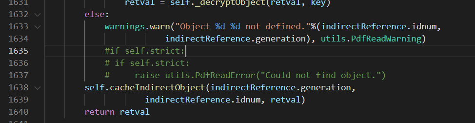
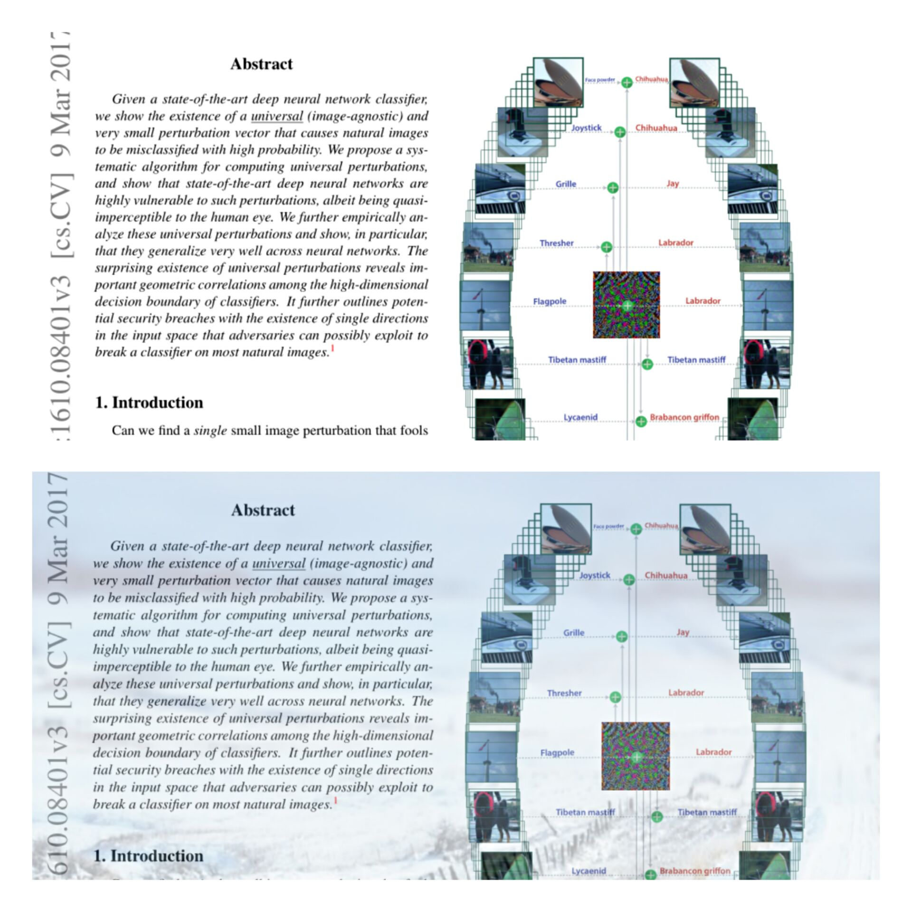
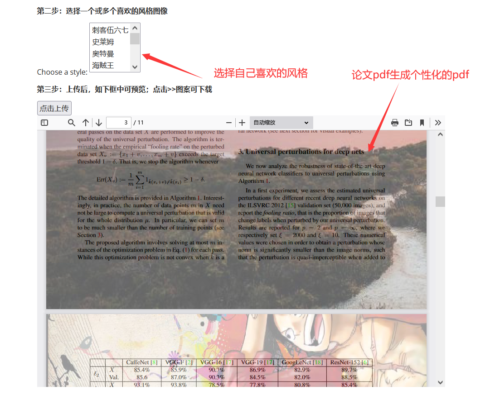
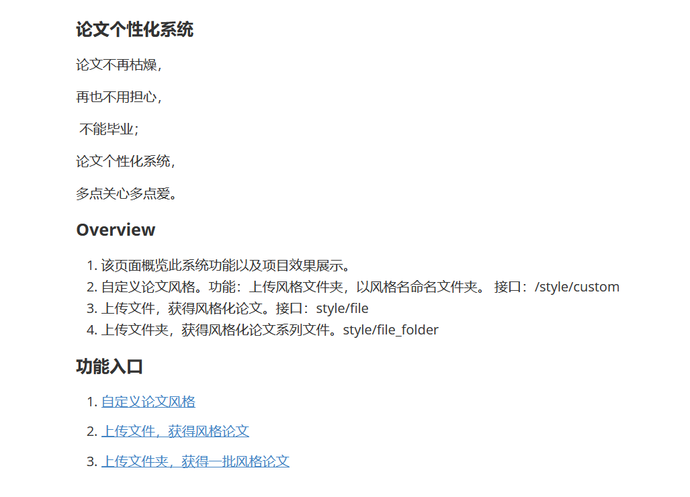

#### 						论文个性化系统

#### 功能

1. **主页导航**，跳转功能页面。
2. **自定义论文风格**。功能：上传风格文件夹，生成自定义的论文风格。 接口：/style/custom
3. **上传文件**，获得风格化论文。接口：style/file
4. **上传文件夹**，获得风格化论文系列文件。style/file_folder

#### 运行

* 安装**requirements.txt** 里面的库。在项目目录路径，运行即可。

```python
pip install -r requirements.txt
```
* 由于**pypdf2**库，内部代码逻辑原因，需要对其进行一定改动。找到**pypdf2/pdf.py** 文件。跳转第1635行，注释掉（如下操作）。
  

* 在项目目录路径，运行即可
```python
python index.py
```
* 浏览器上访问 http://127.0.0.1:5000/ 即可。

**Tips:**

1. 需注意进入http://127.0.0.1:5000/ （主页）后，通过页面导航进入**自定义论文风格化**页面，上传自己喜欢的风格图片。（否则刚开始没有风格文件）
2. 接下来，进入**上传文件页面**就可以选择之前上传的风格。上传pdf，就会返回指定风格化的论文pdf。
3. 上传的文件或者文件夹会保存在**uploads**文件夹中，返回的风格化文件会保存在**handle_pdf**文件夹中。

#### 效果展示



​						    效果对比图（上：原论文pdf，下：风格化的pdf）



​										上传页面效果图



​												主页


